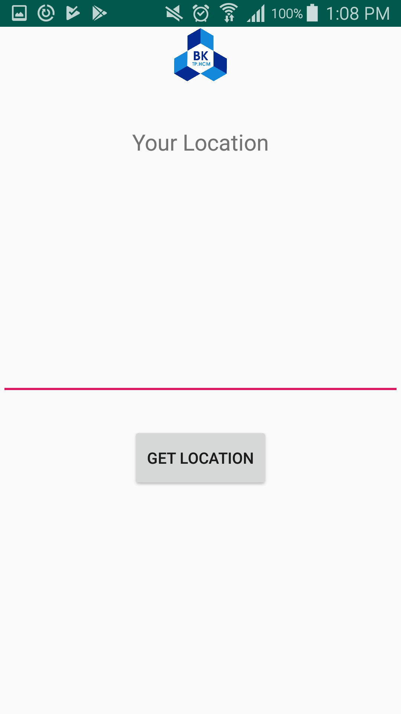
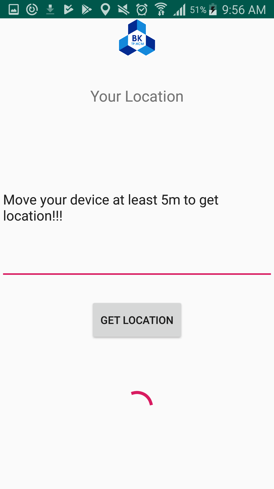
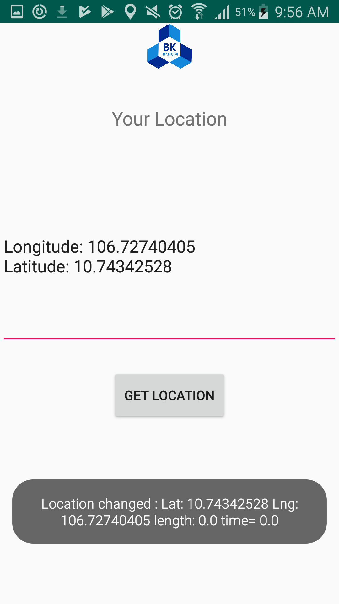
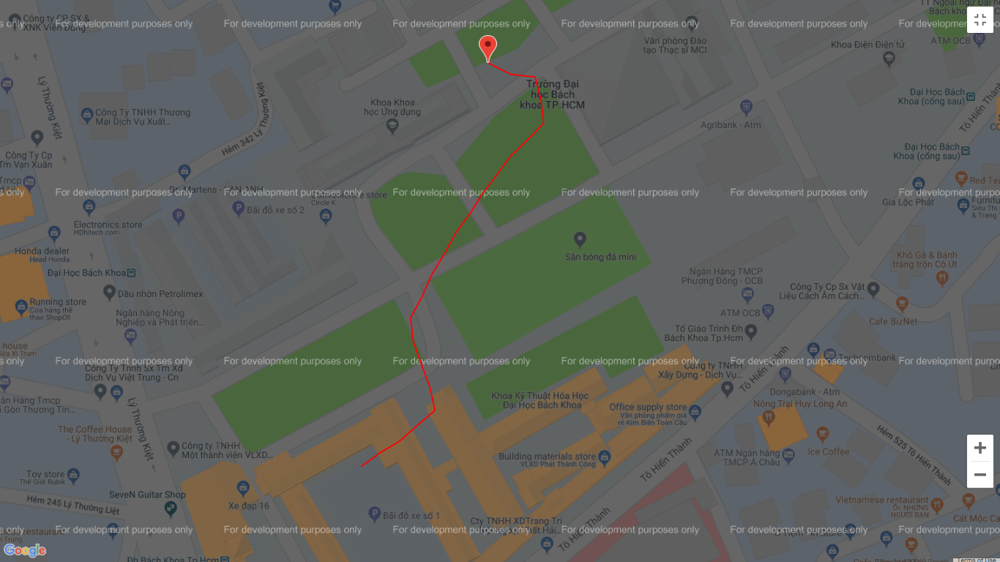

# GPS project

An system contains two things:

* An application on ***Adroid operating system*** which takes mobile's location and sends ***Latitude*** and ***Longitude*** to Google Firebase. 

    
    
    

<figcaption>LEFT: Started Screen - MIDDLE: Move when hitting the button - RIGHT: Get location and send</figcaption>

* A ***website*** takes data from Google Firebase, record and show the path of Android device. Show map by using Google Maps API
  

    

<figcaption>Path in Bach Khoa University</figcaption>

